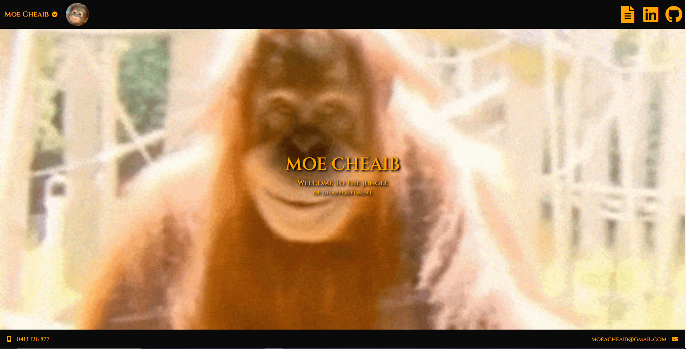
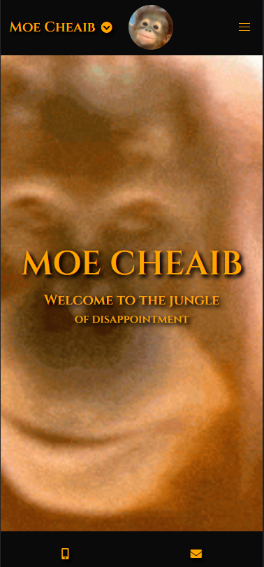

# MoesUpdatedPortfolio

# **Moe Cheaib's Portfolio Page** 

## **Links**

GitHub Repo: https://github.com/moeac/MoesUpdatedPortfolio.git
 
Deployed Website: https://moeac.github.io/MoesUpdatedPortfolio/

## **About**

This is my updated portfolio page 
It is mobile responsive 
Has a drop down for quick access to about, projects, contact and complaint pages 
Icons on top right link to resume.pdf, linkedIn page and github page 
Two navbars top and bottom both fixed to page 
Bottom navbar contains main contact info, mobile and email 
In mobile viewports, contact info changes to just icons instead of text 
Contact info links to direct call, email and google maps address 
Hope you enjoy

## **Screenshots**

Desktop Homepage  

 

Mobile Desktop  

 

Highlighted icons when hovering over Resume, LinkedIn or GitHub  

 

Drop Down Menu when click name  

 

Hovering over a project icon makes it glow  

 

Mobile Layout for bottom of screen  

 

